<div align="center">
  

  # BLFS
  ### Bitcoin Lightning For Shopify
</div>

## About

BLFS (Bitcoin Lightning for Shopify) is a lightweight server application. It connects Shopify merchants to Bitcoin Lightning payments via NWC (Nostr Wallet Connect). 

**Decentralization:** BLFS is designed to be run by anyone. Any developer may run their own BLFS instance and connect merchants to any of many NWC-compatible Lightning services.

** NWC:** BLFS uses Nostr Wallet Connect (NWC) to communicate with Lightning nodes, wallets, and vaults. Merchants provide a receive-only NWC connection string, and BLFS runs a lightweight web server that handles invoice generation, payment monitoring, and marking orders as "paid" in Shopify's database. 

**Incentives:** Developers (subject to agreement with Shopify merchants) may earn fees on each Shopify sale through BLFS. One developer can service multiple merchants. This is an excellent tool for an independent operator who wants to onboard a number of Shopify merchants.

### How BLFS Works: Two Key Roles

#### Role #1: Shopify Merchant 🛍️
The store owner who wants to accept Bitcoin Lightning payments.

#### Role #2: BLFS Developer 👨‍💻
A developer who sets up and operates BLFS to integrate Lightning payments with Shopify store(s).

### Basic Setup: One Developer, One Merchant 

```mermaid
graph LR
  Dev["👨‍💻 BLFS Developer"] --> Merch["🛍️ Shopify Merchant"]
  Merch --> NWC["⚡ NWC Service (e.g., Rizful, Alby Hub, LNbits, Coinos, Wallet of Satoshi)"]
  
  style Dev fill:#e65100,color:#fff
  style Merch fill:#2196f3,color:#fff
  style NWC fill:#9c27b0,color:#fff
```



### Scalable Setup: One Developer, Multiple Merchants 

A single BLFS developer can service multiple Shopify merchants, managing Lightning payment infrastructure for all of them.

```mermaid
graph TD
  Dev["👨‍💻 BLFS Developer"] --> M1["🛍️ Merchant 1"]
  Dev --> M2["🛍️ Merchant 2"]
  Dev --> M3["🛍️ Merchant 3"]
  Dev --> M4["🛍️ Merchant 4"]

  M1 --> NWC1["⚡ Rizful"]
  M2 --> NWC2["⚡ Alby Hub"]
  M3 --> NWC3["⚡ LNbits"]
  M4 --> NWC4["⚡ Wallet of Satoshi"]
  
  style Dev fill:#e65100,color:#fff
  style M1 fill:#2196f3,color:#fff
  style M2 fill:#2196f3,color:#fff
  style M3 fill:#2196f3,color:#fff
  style M4 fill:#2196f3,color:#fff
  style NWC1 fill:#9c27b0,color:#fff
  style NWC2 fill:#9c27b0,color:#fff
  style NWC3 fill:#9c27b0,color:#fff
  style NWC4 fill:#9c27b0,color:#fff
```




### Complete Ecosystem: Maximum Decentralization 

Each merchant can choose any NWC service, and each developer can support multiple merchants. This creates a truly permissionless, censorship-resistant payment infrastructure.

```mermaid
graph TB
  subgraph Devs["👨‍💻 BLFS Developers"]
    D1["Developer 1"]
    D2["Developer 2"]
    D3["Developer 3"]
  end

  subgraph Merchants["🛍️ Shopify Merchants"]
    M1["Store 1"]
    M2["Store 2"]
    M3["Store 3"]
    M4["Store 4"]
    M5["Store 5"]
    M6["Store 6"]
  end

  subgraph NWC["⚡ NWC Services"]
    N1["Rizful"]
    N2["Alby Hub"]
    N3["LNbits"]
    N4["Coinos"]
    N5["Wallet of Satoshi"]
    N6["Zeus"]
  end

  D1 --> M1
  D1 --> M2
  D2 --> M3
  D2 --> M4
  D3 --> M5
  D3 --> M6

  M1 --> N1
  M2 --> N2
  M3 --> N3
  M4 --> N5
  M5 --> N4
  M6 --> N6
  
  style D1 fill:#e65100,color:#fff
  style D2 fill:#e65100,color:#fff
  style D3 fill:#e65100,color:#fff
  style M1 fill:#2196f3,color:#fff
  style M2 fill:#2196f3,color:#fff
  style M3 fill:#2196f3,color:#fff
  style M4 fill:#2196f3,color:#fff
  style M5 fill:#2196f3,color:#fff
  style M6 fill:#2196f3,color:#fff
  style N1 fill:#9c27b0,color:#fff
  style N2 fill:#9c27b0,color:#fff
  style N3 fill:#9c27b0,color:#fff
  style N4 fill:#9c27b0,color:#fff
  style N5 fill:#9c27b0,color:#fff
  style N6 fill:#9c27b0,color:#fff
```



**Key Benefits:**
- 🔀 **No vendor lock-in** - Merchants can switch NWC providers anytime
- 🛡️ **Censorship resistant** - No single point of control or failure
- 🌐 **Geographic diversity** - Developers and services can be anywhere
- 💪 **Resilient** - If one service or developer goes down, others continue operating

---

## Live Example: Sonia Boyajian

See BLFS in action at [soniabstyle.com](https://soniabstyle.com/) - a Los Angeles jewelry and ceramics boutique accepting Bitcoin Lightning payments.

<div align="center">
  
### Select "Pay with Bitcoin Lightning" at checkout


### Click the 'Complete Payment' button


### Pay the Lightning invoice


### Order complete!


</div>

---

## Acknowledgments 

This implementation is inspired by the BTCPay Server Shopify plugin created by [TChukwuleta](https://github.com/TChukwuleta), [ndeet](https://github.com/ndeet), and [NicolasDorier](https://github.com/NicolasDorier).

Our goal was to build something similar, but that did not require a running `bitcoind`, `btcpayserver`, `nbitcoin`, and that required Lightning payments by default, so as to give consumers and merchants a "payment completed in 2 seconds" guarantee. (As long as a high-performance NWC service is used!)

---

## Documentation

Complete documentation is available at [BLFS @ Megalith Lightning Docs](https://docs.megalithic.me/BLFS/getting-started).

1. **[Getting Started](https://docs.megalithic.me/BLFS/getting-started)** - Overview of BLFS architecture, benefits for merchants and operators, and real-world examples.

2. **[First Steps for Merchant](https://docs.megalithic.me/BLFS/first_steps_for_merchant)** `[Merchant]` - Merchant signs up for NWC service, obtains receive-only credentials, and provides Shopify store domain.

3. **[First Steps for Developer](https://docs.megalithic.me/BLFS/first_steps_for_developer)** `[Developer]` - Developer configures domain, VPS hosting, and gathers merchant's NWC credentials and Shopify store URL.

4. **[Shopify Partner Setup](https://docs.megalithic.me/BLFS/shopify-partner-setup-for-developer)** `[Developer]` - Developer creates Shopify Partner account (FREE) and configures custom app with distribution link.

5. **[Click Install Link](https://docs.megalithic.me/BLFS/merchant_uses_install_link)** `[Merchant]` - Merchant installs BLFS custom app to their Shopify store using the distribution link.

6. **[Add Merchant to BLFS](https://docs.megalithic.me/BLFS/developer-add-merchant-to-blfs)** `[Developer]` - Developer starts BLFS server and adds merchant's shop configuration via the developer portal at `/dev`.

7. **[Deploy BLFS To Shop](https://docs.megalithic.me/BLFS/developer-deploy-shop)** `[Developer]` - Developer deploys the BLFS app to merchant's Shopify store and grants necessary permissions.

8. **[Add Buttons & Payment Method](https://docs.megalithic.me/BLFS/merchant_add_buttons_to_ui)** `[Merchant]` - Merchant adds Bitcoin Lightning payment buttons to checkout and configures manual payment method.

9. **[Try a Test Checkout](https://docs.megalithic.me/BLFS/developer_try_a_test_checkout)** `[Developer]` - Developer performs test checkout to verify Bitcoin Lightning payment flow works correctly.
---

## Technical Quickstart

### Prerequisites

- Linux VPS (minimum 1 vCPU, 2 GB RAM)
- Docker and Docker Compose installed
- Domain name pointed to your VPS
- Shopify Partner account (FREE)

### Environment Configuration

1. **Copy the example environment file:**
   ```bash
   cp .env.example .env
   ```

2. **Edit the `.env` file and set these 3 required variables:**

   - **`THIS_APP_DOMAIN`** - Your hostname/domain for BLFS (e.g., `pay.yourdomain.com`)
     ```bash
     THIS_APP_DOMAIN=pay.yourdomain.com
     ```

   - **`MASTER_KEY`** - A 32-byte hex string for encrypting sensitive data. Generate with:
     ```bash
     openssl rand -hex 32
     ```
     Then paste the output:
     ```bash
     MASTER_KEY=your_generated_hex_string_here
     ```

   - **`DEVELOPER_PASSWORD`** - Password for accessing the `/dev` portal
     ```bash
     DEVELOPER_PASSWORD=your_secure_password
     ```

   All other variables in `.env.example` have sensible defaults and don't need to be changed.

### Installation & Startup

1. **Clone the repository:**
   ```bash
   git clone https://github.com/MegalithicBTC/BLFS
   cd BLFS
   ```

2. **Configure environment** (see above)

3. **Start BLFS:**
   ```bash
   ./start.sh
   ```

   This will:
   - Build and start the Docker containers (app + Caddy)
   - Initialize the SQLite database
   - Issue a Let's Encrypt SSL certificate for your domain
   - Start the application on the configured port

4. **Access the Developer Portal:**
   
   Navigate to `https://YOUR_DOMAIN/dev` (e.g., `https://pay.yourdomain.com/dev`)
   
   Log in with your `DEVELOPER_BASIC_USER` and `DEVELOPER_PASSWORD` credentials.
   
   From here you can:
   - Add merchant shops
   - Configure NWC connections
   - Deploy to Shopify stores
   - Monitor transactions

### Quick Commands

```bash
# Start BLFS
./start.sh

# View logs
docker-compose logs -f app

# Stop BLFS
docker-compose down

```

### Architecture

- **Node.js/Express** - Application server
- **TypeORM + SQLite** - Database layer
- **Caddy** - Reverse proxy with automatic HTTPS
- **Docker Compose** - Container orchestration
- **Nostr Wallet Connect** - Lightning payment protocol

### Optional: Litestream Database Replication

BLFS includes optional [Litestream](https://litestream.io/) support for continuous SQLite replication to cloud storage (S3, Google Cloud Storage, Azure Blob Storage, or local filesystem). This provides disaster recovery and enables zero-downtime migrations.

To enable Litestream backups, configure the following in your `.env` file:

```bash
LITESTREAM_REPLICA_URL=s3://your-bucket/replication/app.sqlite
AWS_ACCESS_KEY_ID=your_access_key
AWS_SECRET_ACCESS_KEY=your_secret_key
AWS_REGION=us-east-1
```

See the [Litestream documentation](https://litestream.io/guides/s3/) for detailed configuration options.

---

## MIT License

```
MIT License

Copyright (c) 2025 Megalithic.me

Permission is hereby granted, free of charge, to any person obtaining a copy
of this software and associated documentation files (the "Software"), to deal
in the Software without restriction, including without limitation the rights
to use, copy, modify, merge, publish, distribute, sublicense, and/or sell
copies of the Software, and to permit persons to whom the Software is
furnished to do so, subject to the following conditions:

The above copyright notice and this permission notice shall be included in all
copies or substantial portions of the Software.

THE SOFTWARE IS PROVIDED "AS IS", WITHOUT WARRANTY OF ANY KIND, EXPRESS OR
IMPLIED, INCLUDING BUT NOT LIMITED TO THE WARRANTIES OF MERCHANTABILITY,
FITNESS FOR A PARTICULAR PURPOSE AND NONINFRINGEMENT. IN NO EVENT SHALL THE
AUTHORS OR COPYRIGHT HOLDERS BE LIABLE FOR ANY CLAIM, DAMAGES OR OTHER
LIABILITY, WHETHER IN AN ACTION OF CONTRACT, TORT OR OTHERWISE, ARISING FROM,
OUT OF OR IN CONNECTION WITH THE SOFTWARE OR THE USE OR OTHER DEALINGS IN THE
SOFTWARE.
```

---

## Support

For detailed setup instructions, troubleshooting, and best practices, visit the [complete documentation](https://docs.megalithic.me/category/blfs-bitcoin-lightning-for-shopify).
